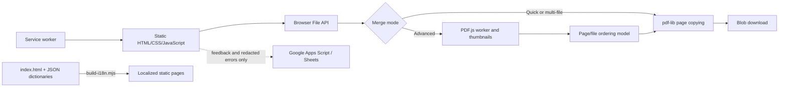
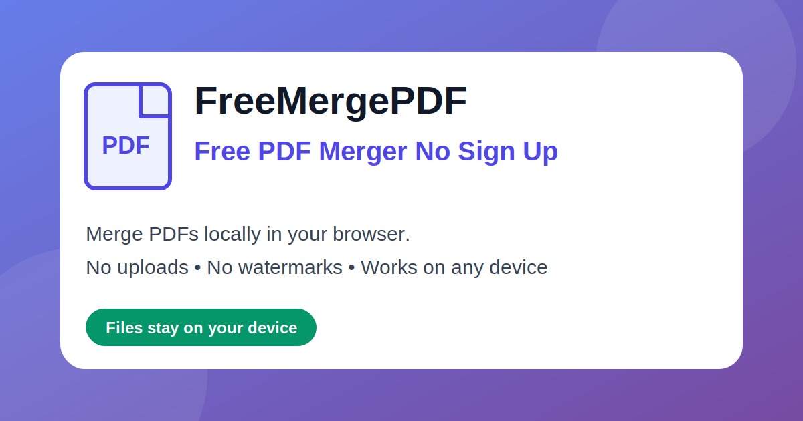

# FreeMergePDF

A static web application that merges and reorders PDFs entirely in the browser, keeping document contents off an application server.

## Overview

FreeMergePDF exists to provide a no-sign-up PDF workflow without uploading source documents for processing. I built the browser UI, local merge pipeline, page-preview and ordering tools, offline cache, localization generator, and feedback/error-reporting integration as a dependency-light site made from HTML, CSS, and JavaScript.

The application offers a quick two-file path and a multi-file path. Both use `pdf-lib` to assemble the result in memory; advanced mode uses PDF.js to render page thumbnails before the user downloads the generated file.

## Features

- Merge two PDFs or a multi-file batch locally in the browser.
- Reorder files or individual pages with drag-and-drop controls.
- Remove pages, restore the original order, and choose the output filename.
- Apply structural compression or configurable raster compression for image-heavy pages.
- Use localized homepages in English plus 10 generated translations, including right-to-left Arabic.
- Continue using the cached application shell after the first successful load.

## Technical Highlights

- **Local document pipeline:** selected files remain browser `File` objects. `pdf-lib` loads them, copies pages into a new document, serializes the result, and triggers a Blob download without a PDF upload endpoint.
- **Two levels of interaction:** the fast path combines files in sequence, while `AdvancedPDFMerger` builds page and file models for thumbnail rendering, deletion, touch/drag ordering, background pre-rendering, and reset behavior.
- **Failure-tolerant PDF handling:** the merge code identifies encrypted, corrupt, inaccessible, and memory-heavy inputs; it can skip failed files, rasterize some damaged pages, and gives device-aware size warnings before expensive work.
- **Worker recovery:** advanced preview prefers the self-hosted PDF.js worker, probes availability, falls back to the matching CDN worker, and uses a session-scoped circuit breaker when worker startup fails.
- **Offline strategy:** a service worker precaches required same-origin assets, uses network-first navigation, and applies stale-while-revalidate caching to application and CDN resources. Required-asset failures prevent activation of an incomplete shell.
- **Generated localization:** `index.html` is the canonical homepage. A Node.js generator validates common dictionary keys, rewrites language metadata and asset paths, supports RTL output, and injects runtime translations into 10 localized pages.
- **Operational feedback:** a Google Apps Script backend validates and stores feedback and client error reports in separate Google Sheets. The client redacts email-like text, suppresses known third-party noise, throttles duplicate reports, and falls back to Google Forms if the primary error endpoint fails.
- **Current verification boundary:** the repository has no automated test suite. Its first-party JavaScript currently passes syntax checks, and the localization generator provides consistency checks when translations are rebuilt.

## Architecture



PDF contents flow from the browser's file picker to the in-memory merge pipeline and then to a local download. The optional backend receives feedback and diagnostic metadata, not PDF files. Localized pages reuse the same application scripts so merge behavior has one implementation.

## Tech Stack

- HTML5, CSS3, and vanilla JavaScript
- [pdf-lib 1.17.1](https://pdf-lib.js.org/) for PDF assembly
- [PDF.js 3.11.174](https://mozilla.github.io/pdf.js/) for parsing and preview rendering
- Service Worker, Cache, File, Blob, and Canvas browser APIs
- Node.js ES modules for localization generation
- Google Apps Script and Google Sheets for feedback and error collection
- Google Analytics event instrumentation

## Getting Started

No dependency installation or build step is required for the English site. Serve the repository root with a static HTTP server, then open `/index.html` in a modern browser. The repository does not define a project-specific server command, so use the static server available in your environment.

HTTP serving is recommended because the service worker requires it and the application uses root-relative assets. Opening `index.html` directly can limit advanced preview when PDF worker files cannot load.

To validate the first-party JavaScript:

```powershell
node --check advanced-pdf-merger.js
node --check index-page.js
node --check page-merge-ui.js
node --check feedback.js
node --check error-reporting.js
node --check i18n-runtime.js
node --check sw.js
node --check tools/build-i18n.mjs
```

After changing `index.html` or a translation dictionary, regenerate and commit the localized pages:

```powershell
node tools/build-i18n.mjs
```

The generator stops with an error if dictionaries have different key sets or a source string no longer exists in `index.html`.

## Demo

Live site: [freemergepdf.com](https://freemergepdf.com/)

The repository also includes the social preview asset used by the site:



## Project Status

**Active.** The static application, localized pages, offline cache, feedback path, and error-reporting path are implemented. No planned work is declared in the repository.

## What I Learned

- Keeping sensitive file processing client-side changes the main constraints from server throughput to browser memory, worker availability, and useful recovery paths.
- A simple merge path and an advanced preview path can share one output pipeline while preserving a fast default experience.
- Static sites still need operational design: cache versioning, required-asset checks, telemetry filtering, privacy boundaries, and failure fallbacks matter even without an application server.
- Generating localized pages from one source file avoids duplicated application logic, while strict dictionary validation prevents silent translation drift.
